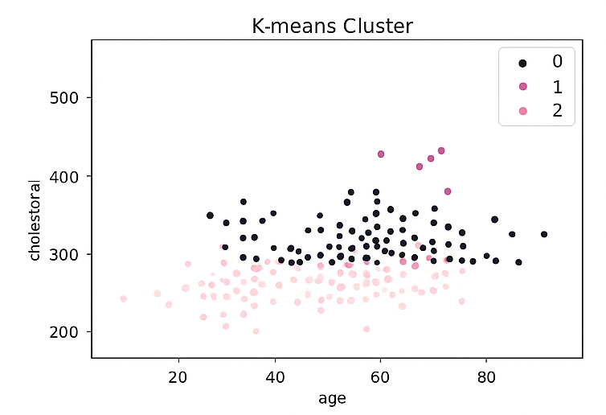
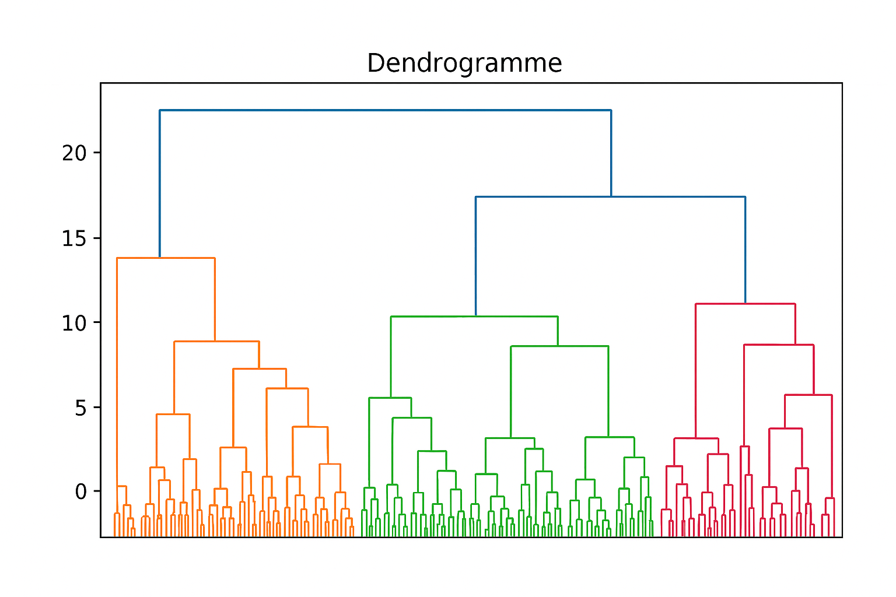

# 🌸 Clustering Mini Project — Heart Patients Dataset

This project demonstrates **unsupervised clustering analysis** on a dataset of heart patients.  
The goal is to identify **patterns and groups** in the dataset without using the target variable.

- **K-means**
- **K-medoids**
- **Hierarchical clustering**

---

## 🧠 Objectives

- Understand clustering concepts  
- Visualize groups of customers  
- Compare clustering methods  
- Evaluate cluster quality  

---

## 🛠 Tools

- Python  
- Pandas  
- Scikit-Learn  
- Matplotlib (soft pink theme)  
- Seaborn  

---

## 📁 Files

- `notebook.ipynb` — Full code  
- `dataset.csv` — Sample dataset  
- `images/` — Cluster visualizations  

---

## 🌷 Results

- K-means created
-  **2 stable clusters**  
- Hierarchical clustering showed similar segmentation  
- Elbow method used to choose optimal k  

---

## 🖼 Example Visualization

---

## 📫 Contact  
**malakkharbech@gmail.com**
